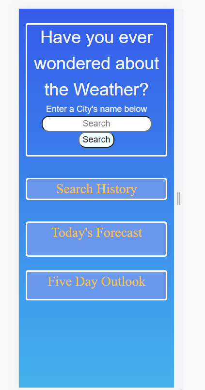
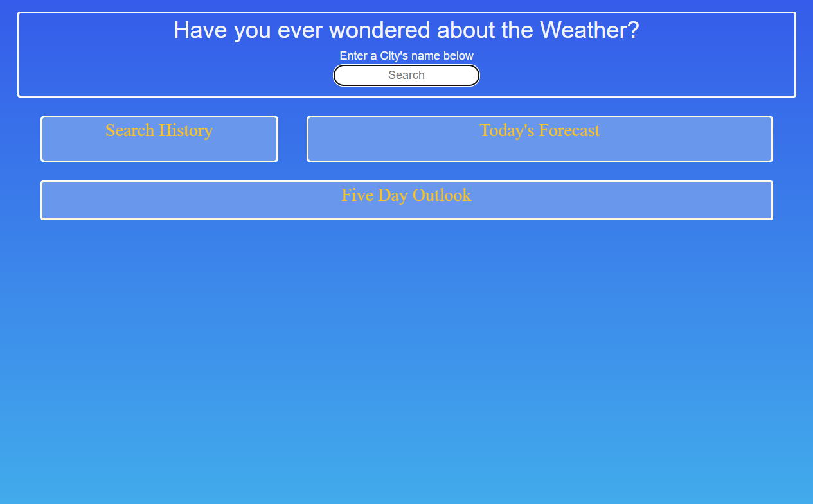

# what-is-the-weather
This app is a simple weather app that calls the openWeather API for geocoding coordinates and again for weather information
The data retrieved is stored in local storage as well as on the page where the user can click previously searched cities to once again view the current weather for that city

(fun fact!)
The Geocoding API used also accepts numbers as a parameter, if the user inputs a number, the name of the location is returned and added to the screen instead of the number. The only exception being the number "99" which apparently is the name of a russian obelisk on the outskirts of Moscow.

# Screenshots
This is a screenshot of the App deployed on a mobile phone with 320px width

The media queery breakpoint is set to shift the below view once the viewport is the size of an ipad.

# URL
 a link to this repository:

 https://github.com/JoshEflin/five-day-outlook

 a link to the deployed webpage:

 https://josheflin.github.io/five-day-outlook/

